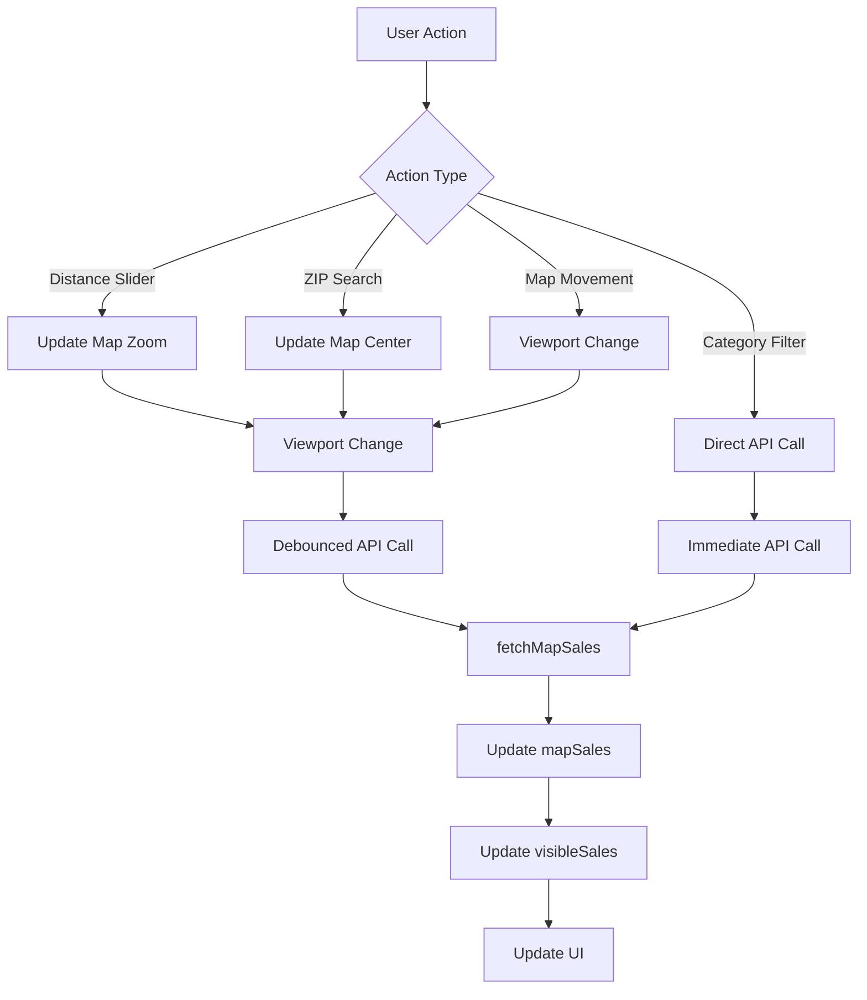

# Map-Centric Architecture Guide

**Last updated: 2025-01-27 — Map-Centric Architecture**

This guide provides a comprehensive overview of LootAura's map-centric architecture, explaining how the map viewport serves as the single source of truth for all sales data and user interactions.

## 🎯 Overview

LootAura uses a **map-centric architecture** where the map viewport is the single source of truth for all sales data. This design eliminates complex state management, reduces API calls, and provides an intuitive user experience where "the map decides what you see."

## 🏗️ Core Principles

### 1. Single Source of Truth
The map viewport determines what sales are visible in both the map and the list. No competing data sources or complex state synchronization.

### 2. Single Fetch Path
Only **2 entry points** to `fetchMapSales`:
- **`handleViewportChange`** (debounced) - for map movements, zoom changes, ZIP search
- **`handleFiltersChange`** (immediate) - for category/date filter changes

### 3. Distance-to-Zoom Mapping
Distance slider controls map zoom instead of API filtering:
- **2 mi** → **z14** (very close)
- **5 mi** → **z12** (close)
- **10 mi** → **z10** (medium)
- **25 mi** → **z8** (far)

### 4. Viewport-Based Filtering
All data fetching uses map viewport bounds (`north`, `south`, `east`, `west`) instead of distance-based filtering.

## 🔄 Data Flow

### High-Level Flow

```
User Action → Map Viewport Change → Single API Fetch → Display Results
```

### Detailed Flow



### Entry Points

#### 1. Viewport Changes (`handleViewportChange`)

**Triggers:**
- Map pan/zoom
- ZIP search
- Distance slider changes

**Process:**
```typescript
const handleViewportChange = useCallback(({ center, zoom, bounds }) => {
  // Update map view state
  setMapView(prev => ({ ...prev, center, zoom, bounds }))
  
  // Debounced API call (300ms)
  debounceTimerRef.current = setTimeout(() => {
    fetchMapSales(bounds)
  }, 300)
}, [fetchMapSales])
```

#### 2. Filter Changes (`handleFiltersChange`)

**Triggers:**
- Category filter changes
- Date range changes

**Process:**
```typescript
const handleFiltersChange = (newFilters) => {
  // Check if distance change
  if (newFilters.distance !== filters.distance) {
    // Update zoom instead of API call
    const newZoom = distanceToZoom(newFilters.distance)
    setMapView(prev => ({ ...prev, zoom: newZoom }))
    return
  }
  
  // Immediate API call for other filters
  updateFilters(newFilters)
  fetchMapSales(mapView.bounds, newFilters)
}
```

## 🗺️ Map-Centric Components

### SalesClient (`app/sales/SalesClient.tsx`)

The main component that orchestrates the map-centric architecture:

```typescript
interface SalesClientProps {
  // Map-centric state
  mapView: MapViewState
  mapSales: Sale[]
  visibleSales: Sale[]
  
  // Single fetch path
  fetchMapSales: (bbox: Bbox, filters?: Filters) => Promise<void>
  
  // Distance-to-zoom mapping
  distanceToZoom: (distance: number) => number
}
```

**Key Responsibilities:**
- Manage map viewport state
- Coordinate single fetch path
- Handle distance-to-zoom mapping
- Synchronize map and list data

### SimpleMap (`components/location/SimpleMap.tsx`)

The main map component with hybrid clustering:

```typescript
interface SimpleMapProps {
  center: { lat: number; lng: number }
  zoom: number
  pins: {
    sales: Sale[]
    selectedId: string | null
    onPinClick: (id: string) => void
    onClusterClick: (data: ClusterData) => void
  }
  onViewportChange: (viewport: ViewportData) => void
}
```

**Key Features:**
- Hybrid clustering system
- Viewport change notifications
- Pin interaction handling
- Loading state management

### FiltersBar (`components/sales/FiltersBar.tsx`)

Filter controls that integrate with map-centric architecture:

```typescript
interface FiltersBarProps {
  // Filter state
  categories: string[]
  dateRange: string
  distance: number
  
  // Map-centric handlers
  onCategoriesChange: (categories: string[]) => void
  onDateRangeChange: (dateRange: string) => void
  onDistanceChange: (distance: number) => void
  
  // Loading state
  isLoading: boolean
}
```

**Key Features:**
- Distance-to-zoom integration
- Loading state feedback
- Filter chip interactions
- Responsive design

## 🔧 Distance-to-Zoom Mapping

### Implementation

```typescript
const distanceToZoom = (distance: number): number => {
  switch (distance) {
    case 2: return 14  // Very close - high zoom
    case 5: return 12  // Close - medium-high zoom
    case 10: return 10 // Medium - medium zoom
    case 25: return 8  // Far - low zoom
    default: return 10 // Default to medium zoom
  }
}
```

### Benefits

1. **Map-Centric**: Zoom level determines visible area
2. **Performance**: No server-side distance filtering
3. **UX**: Intuitive zoom-based search area control
4. **Consistency**: Single source of truth for visible area

### User Experience

- **2 mi**: Very close view, high detail
- **5 mi**: Close view, good detail
- **10 mi**: Medium view, balanced detail
- **25 mi**: Wide view, overview level

## 📊 State Management

### Map View State

```typescript
interface MapViewState {
  center: { lat: number; lng: number }
  bounds: { west: number; south: number; east: number; north: number }
  zoom: number
}
```

**Purpose:** Single source of truth for map viewport

### Sales State

```typescript
interface SalesState {
  mapSales: Sale[]        // Raw sales from API
  visibleSales: Sale[]    // Filtered sales for display
  loading: boolean        // Fetch state
  selectedPinId: string | null
}
```

**Purpose:** Derived from map viewport and filters

### Filter State

```typescript
interface FilterState {
  categories: string[]
  dateRange: string
  distance: number
}
```

**Purpose:** Controls map zoom and API parameters

## 🚀 Performance Optimizations

### 1. Debouncing

```typescript
// 300ms debounce for viewport changes
debounceTimerRef.current = setTimeout(() => {
  fetchMapSales(bounds)
}, 300)
```

**Benefits:**
- Prevents excessive API calls
- Smooth user experience
- Reduced server load

### 2. Bounds Change Detection

```typescript
// Only fetch if bounds change significantly (>5%)
const latChange = Math.abs(bounds.north - bounds.south - (lastBounds.north - lastBounds.south)) / (lastBounds.north - lastBounds.south)
const lngChange = Math.abs(bounds.east - bounds.west - (lastBounds.east - lastBounds.west)) / (lastBounds.east - lastBounds.west)

if (latChange < 0.05 && lngChange < 0.05) {
  return // Skip fetch
}
```

**Benefits:**
- Prevents unnecessary API calls
- Maintains performance during zoom
- Reduces network traffic

### 3. Request Cancellation

```typescript
// Cancel in-flight requests
if (abortControllerRef.current) {
  abortControllerRef.current.abort()
}
abortControllerRef.current = new AbortController()
```

**Benefits:**
- Prevents race conditions
- Improves responsiveness
- Reduces memory usage

### 4. Hybrid Clustering

```typescript
const hybridResult = useMemo(() => {
  if (loading) return { type: 'individual', pins: [], locations: [], clusters: [] }
  if (mapSales.length < 3) return { type: 'individual', pins: [], locations: [], clusters: [] }
  
  return createHybridPins(mapSales, currentViewport)
}, [mapSales, currentViewport, loading])
```

**Benefits:**
- Reduces DOM elements
- Improves rendering performance
- Better user experience

## 🧪 Testing Strategy

### Unit Tests

```typescript
describe('Map-Centric Architecture', () => {
  test('distance-to-zoom mapping', () => {
    expect(distanceToZoom(2)).toBe(14)
    expect(distanceToZoom(5)).toBe(12)
    expect(distanceToZoom(10)).toBe(10)
    expect(distanceToZoom(25)).toBe(8)
  })
  
  test('single fetch path', () => {
    // Test only 2 entry points to fetchMapSales
  })
  
  test('viewport change triggers fetch', () => {
    // Test viewport changes trigger API calls
  })
})
```

### Integration Tests

```typescript
describe('Map-List Synchronization', () => {
  test('map viewport changes update list', () => {
    // Test map and list stay synchronized
  })
  
  test('filter changes trigger single API call', () => {
    // Test filter changes don't cause multiple calls
  })
  
  test('ZIP search updates both map and list', () => {
    // Test ZIP search integration
  })
})
```

### E2E Tests

```typescript
describe('Map-Centric User Flows', () => {
  test('complete user journey', () => {
    // Test complete user interaction flow
  })
  
  test('performance under load', () => {
    // Test performance with many sales
  })
})
```

## 🔍 Debugging

### Debug Mode

Enable debug mode to see map-centric architecture in action:

```bash
NEXT_PUBLIC_DEBUG=true
```

### Debug Features

1. **API Call Tracking**: See single fetch path in action
2. **Viewport Monitoring**: Track viewport changes
3. **Distance-to-Zoom**: See zoom level changes
4. **Performance Metrics**: Monitor fetch timing

### Debug Console Output

```
[FETCH] API Call #1 - Single fetch path verification
[SALES] Entry point: VIEWPORT_CHANGE - Single fetch verification
[DISTANCE] Converting distance to zoom: { distance: 5, zoom: 12 }
[FILTERS] Entry point: FILTER_CHANGE - Single fetch verification
```

## 🚨 Common Pitfalls

### 1. Creating Additional Entry Points

❌ **Don't do this:**
```typescript
// Creating additional entry points
const handleSpecialCase = () => {
  fetchMapSales(bounds) // Violates single fetch path
}
```

✅ **Do this:**
```typescript
// Use existing entry points
const handleSpecialCase = () => {
  handleViewportChange(newViewport) // Uses existing entry point
}
```

### 2. Bypassing Distance-to-Zoom Mapping

❌ **Don't do this:**
```typescript
// Sending distance to API
const params = new URLSearchParams()
params.set('distance', distance.toString()) // Violates map-centric design
```

✅ **Do this:**
```typescript
// Use distance-to-zoom mapping
const newZoom = distanceToZoom(distance)
setMapView(prev => ({ ...prev, zoom: newZoom }))
```

### 3. Creating Competing Data Sources

❌ **Don't do this:**
```typescript
// Creating separate data source
const [listSales, setListSales] = useState<Sale[]>([])
const [mapSales, setMapSales] = useState<Sale[]>([]) // Violates single source
```

✅ **Do this:**
```typescript
// Use single data source
const [mapSales, setMapSales] = useState<Sale[]>([])
const visibleSales = useMemo(() => 
  mapSales.filter(sale => isInViewport(sale, mapView.bounds)), 
  [mapSales, mapView.bounds]
)
```

## 🔮 Future Considerations

### 1. Caching

```typescript
// Cache sales by viewport bounds
const cacheKey = `${bounds.north},${bounds.south},${bounds.east},${bounds.west}`
if (salesCache.has(cacheKey)) {
  return salesCache.get(cacheKey)
}
```

### 2. Virtualization

```typescript
// Virtual scrolling for large lists
const VirtualizedSalesList = ({ sales, viewport }) => {
  return (
    <VirtualList
      items={sales}
      itemHeight={200}
      viewportHeight={viewport.height}
    />
  )
}
```

### 3. Real-time Updates

```typescript
// WebSocket updates
useEffect(() => {
  const ws = new WebSocket('ws://localhost:3000/sales')
  ws.onmessage = (event) => {
    const newSale = JSON.parse(event.data)
    setMapSales(prev => [...prev, newSale])
  }
}, [])
```

## 📚 Related Documentation

- [Architecture Overview](architecture.md)
- [API Documentation](api.md)
- [Testing Guide](testing.md)
- [Debug Guide](debug-guide.md)
- [Contributing Guide](../CONTRIBUTING.md)

## 🎯 Summary

The map-centric architecture provides:

1. **Simplicity**: Single source of truth eliminates complexity
2. **Performance**: Optimized API calls and rendering
3. **UX**: Intuitive map-based interaction
4. **Maintainability**: Clear data flow and state management
5. **Scalability**: Efficient handling of large datasets

By following these principles, LootAura delivers a fast, intuitive, and maintainable yard sale discovery experience.
